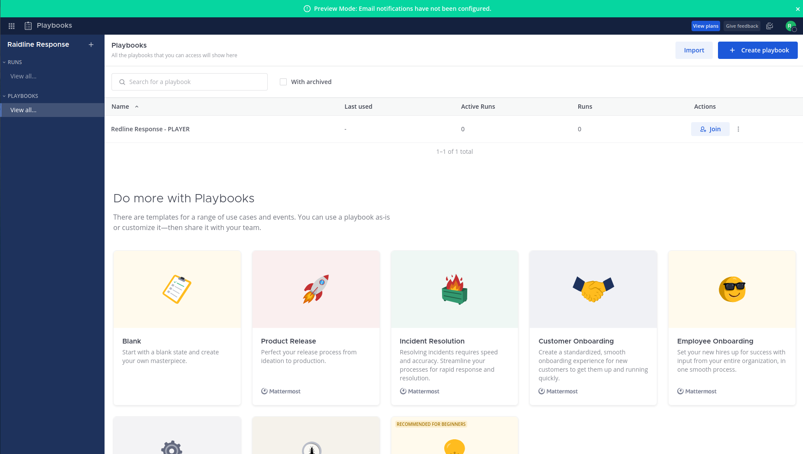
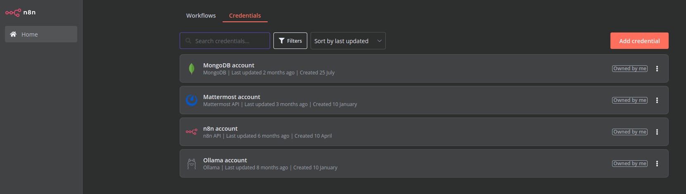
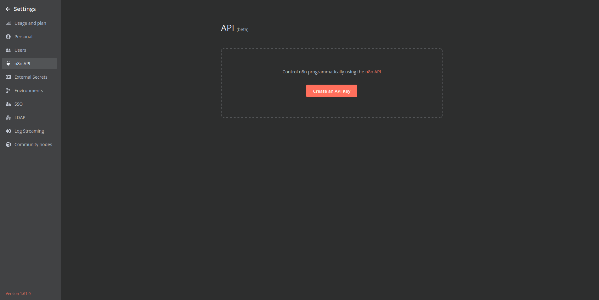

# Raidline on Linux / MacOS

 

RAIdline is a gaming platform to practice your Incident Response skills, leveraging Mattermost, n8n automation and LLMs to create and have you play interactive scenario !

## Prerequsites

You should make sure to have the following installed on your machine beforehand:
* Docker (https://docs.docker.com/desktop/install/mac-install/ or https://docs.docker.com/desktop/install/linux/)
* Ollama (https://ollama.com/)
    * With Gemma2 (ollama run gemma2) and Llama3 (ollama run llama3) and mistral-nemo models running
* jq (https://jqlang.github.io/jq/)

## Install Raidline from scratch

Clone the repo from github.

Navigate to the `scripts` directory.

Then ensure the install and check files are executable :

```
chmod +x *_setup_raidline_response.sh

chmod +x check_all_is_good.sh
```

And then perform controls and initial setup with check_all_is_good.sh script to ensure that everything seems to be in place :

```
./check_all_is_good.sh
```

This will create a .env file with adhoc credentials.

and finally execute the shell file in the same directory, depending on you architecture :

```
./linux_setup_raidline_response.sh
```
or

```
./mac_setup_raidline_response.sh
```

## Launch Raidline to validate install

Open you browser and connect to :

### Mattermost
You can go to you local mattermost instance :
* http://localhost:8065/login 

and test the login and password setup in the .ENV file.

Then you can check if the playbook template Raidline Response exist, and join it:




### N8N 

You can find the local instance here:
http://localhost:5678/setup

Start by creating your user.

#### Credentials and Workflows
You should see the workflows and credentials in you home page, in the corresponding tabs.



* Ollama :

If the credential is not recognized by n8n (for Ollama on Linux for instance) :
You might have to replace the host/IP (e.g. 172.17.0.1).
You can check it with the following command: 
```
ip addr show | grep "\binet\b.*\bdocker0\b" | awk '{print $2}' | cut -d '/' -f 1
```

If you're using custom port (different from 11434), you might want to change it here as well.

Please check this FAQ out on [Ollama Github](https://github.com/ollama/ollama/blob/main/docs/faq.md)

* N8N :

Ensure that the API key is created and then added to the related credential.



### Ollama

To be able to run rAIdline, you should at least have 3 models installed via Ollama :
* gemma2 (9b by default)
* llama3.1 (8b by default)
* mistral-nemo (12b by default)

or test alternatively :

* mistral (7b)

You should thus, depending on your install (dockerized or not), run the following commands :
```
docker exec -it ollama ollama run gemma2
```
or 
```
ollama run gemma2
```
Depending on your machine/architecture, you might upgrade your experience and be able to run heavier models.

see Ollama documentation for more details.

## Checkup Raidline first steps to be able to use it

Once previous steps have been done, you can connect to the form workflow as instructed at the end of the installation script :

http://localhost:5678/form/f9cc31d9-9328-40b1-a295-d244a043b13d

And then go directly to the admin panel to start a new run :

http://localhost:5678/webhook/dba9d340-6994-417b-8cff-7c7abae42a5e 

This should create a new playbook run in your mattermost environnement (reachable here: http://localhost:8065/)

## Uninstall / Reset your install of Raidline

Sorry to see you go... But it surely is to start a new fresh instance of rAIdline !

To delete current instance : 

* Navigate to the `scripts` directory.

* Ensure the proper file is executable :

```
chmod +x destroy_raidline_response.sh
```

* and execute the shell file in the same directory :

```
./destroy_raidline_response.sh
```

This should stop and remove the related containers via a docker compose down and suppress the mongodb. If you have added any related volume, you can uncomment the 'docker volume prune' command in the script.