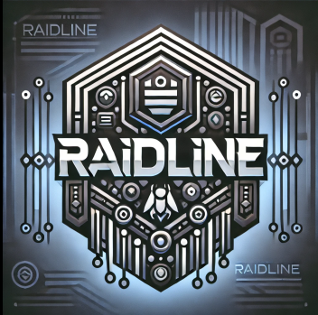

# Raidline on Linux / MacOS


## Prerequsites

You should make sure to have the following installed on your machine beforehand:
* Docker (https://docs.docker.com/desktop/install/mac-install/ or https://docs.docker.com/desktop/install/linux/)
* Ollama (https://ollama.com/)
    * With Gemma2 (ollama run gemma2) and Llama3 (ollama run llama3) models running
* jq (https://jqlang.github.io/jq/)

## Install Raidline from scratch

Clone the repo from github.

Then ensure the install file is executable :

```
chmod +x setup_raidline_response.sh
```

And then check with check_all_is_good.sh script to ensure that everything seems to be in place :

```
./check_all_is_good.sh
```

This will create a .env file with adhoc credentials.

and finally execute the shell file in the same directory :

```
./setup_raidline_response.sh
```

## Launch Raidline to validate install

Open you browser and connect to :

### Mattermost
You can go to you local mattermost instance :
* http://localhost:8065/login 

and test the login and password setup in the .ENV file.

Then you can check if the playbook template Raidline Response exist, and join it:


### N8N 

You can find the local instance here:
http://localhost:5678/setup

Start by creating your user.

#### Credentials and Workflows
You should see the workflows and credentials in you home page, in the corresponding tabs.


* Ollama :
If the credential is not recognized by n8n (for Ollama on Linux for instance) :
You might have to replace the host/IP (172.17.0.1).
If you're using custom port (different from 11434), you might want to change it here as well.

Please check this FAQ out :
https://github.com/ollama/ollama/blob/main/docs/faq.md


## Uninstall / Reset your install of Raidline

Ensure the proper file is executable :

```
chmod +x destroy_raidline_response.sh
```

and execute the shell file in the directory :

```
./destroy_raidline_response.sh
```